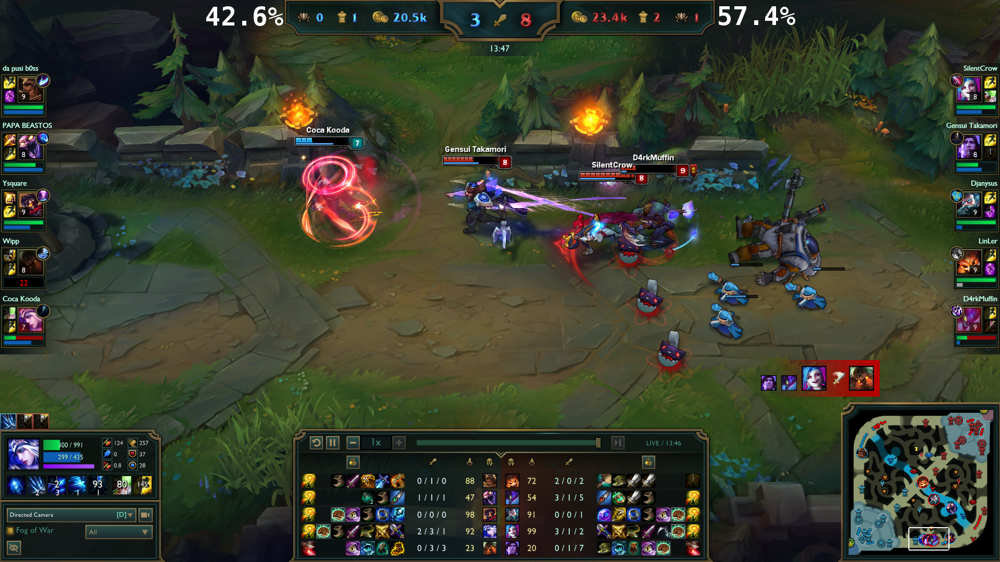

# In-game winning probabilities

This project display winning probabilities for a League of Legends game in spectator mode in real-time.

If you want more details you can check out [this blogpost](https://benfradet.github.io/blog/2016/10/22/riot-games-2016-hackathon).

## ETL

The ETL uses the [Riot Games API](https://developer.riotgames.com/) to gather match data.

## Model

A classifier (random forest) is built using [Apache Spark](http://spark.apache.org/) and the data previously collected.

## Streaming app

A streaming application reads game data sent in real-time by our client from a [Kafka](http://kafka.apache.org/) topic,
interrogates our previously built model and post the probabilities of each team winning to another topic.

## Webservice

The webservice acts as an intermediary between the client and Kafka.

## Client

The client captures game data thanks to [the LeagueReplayHook](https://developer.riotgames.com/), sends this data to the webservice
and displays the probabilities thanks to [Overwolf](http://www.overwolf.com/index.html).
